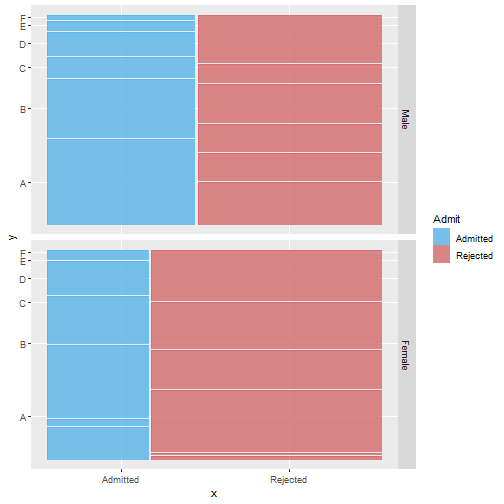

Shiny app presentation
========================================================
author: Igor FIDALGO - Arthur LAUREAU
date: November 28, 2019
autosize: true

1. Introduction
========================================================

The Shiny Application project:

- This project is a simple hello world project to learn how to make a **Shiny app** and a related **presentation** using **RStudio**.
- To learn more, see [our github](https://github.com/Igzs/R_shiny_pres).  
- You can also test [our application](https://igzs.shinyapps.io/shiny_app/)
- Link to the [presentation](https://rpubs.com/igz/shiny_pres)

2. Dataset summary
========================================================
The UCBAdmissions data set is frequently used for illustrating Simpson's paradox, see [Bickel et al (1975)](http://www.jstor.org/stable/1739581). At issue is whether the data show evidence of sex bias in admission practices.  

The UCBAdmissions data set is 3-dimensional array resulting from cross-tabulating 4526 observations on 3 variables. The variables and their levels are as follows: 

| No   |  Name  |       Levels       |
|:----:|:------:|:------------------:|
|   1  |  Admit | Admitted, Rejected |
|   2  | Gender |    Male, Female    |
|   2  |  Dept  |     A,B,C,D,E,F    |
  


3. Functionnalities
========================================================

- Navbar architecture
-- Documentation included in the app
- Different graphs 
-- Mosaic plot and pie charts
- Compare results
-- Highlight Simpson's Paradox
  

```r
summary(UCBAdmissions)
```

```
Number of cases in table: 4526 
Number of factors: 3 
Test for independence of all factors:
	Chisq = 2000.3, df = 16, p-value = 0
```
4. Plot example
========================================================

