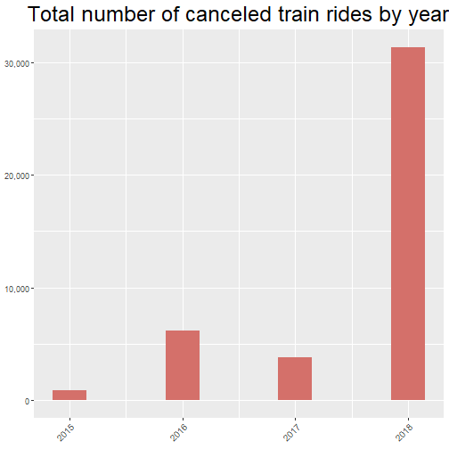
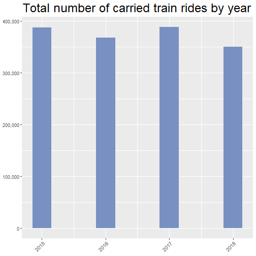
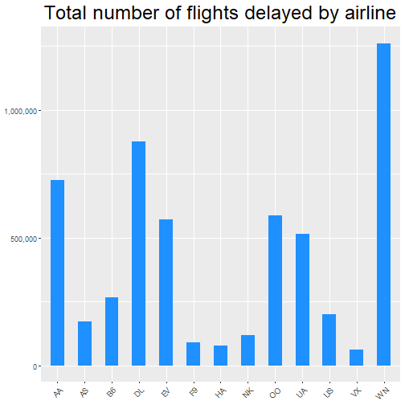
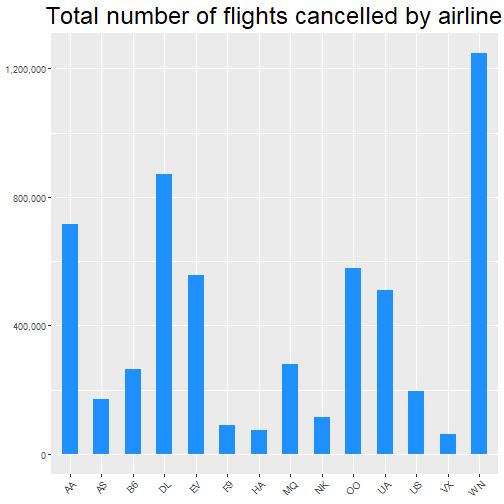

<style>
.background .reveal .state-background{
  background: #E6F6FF
}
</style>

R Project presentation
========================================================
author: Igor Fidalgo, Arthur Laureau, Ruben Poretz
date: 19/12/2019
autosize: true
font-family: 'Roboto'


Goal of the project
========================================================
type: background
<p class=e> The goal of this project is to construct dashboards displaying information about SNCF rail trafic and US flights. 
This project is the synthesis of every concept reviewed during this Data Analytics course:</p>

- Getting and cleaning data
- Explore Data
- Developp Shiny applications

SNCF Dataset
========================================================
type:background
The dataset associated contains aggregated information about rail trafic accross 4 years.At issue is whether the data show signs of improvement or degradation of the state of french rail trafic. 

- We only used the full_trains dataset
- There were 5462 observations accross 59 train stations.

At issue is whether the data show signs of improvement or degradation of the state of french rail trafic. 

Dataset Columns
========================================================
type:background

```
 [1] "year"                        "month"                      
 [3] "service"                     "departure_station"          
 [5] "arrival_station"             "journey_time_avg"           
 [7] "total_num_trips"             "num_of_canceled_trains"     
 [9] "comment_cancellations"       "num_late_at_departure"      
[11] "avg_delay_late_at_departure" "avg_delay_all_departing"    
[13] "comment_delays_at_departure" "num_arriving_late"          
[15] "avg_delay_late_on_arrival"  
```

Some Graphs of the SNCF dashboard
========================================================
class:title
type:background



***


US Flights dataset
========================================================
type:background
Three datasets were used to construct this dashboard: 
 - Airlines: Maps IATA flight codes to a specific airline.
 - Airports: Maps IATA flight codes to airports geographical information
 - Flights: Contains an overview of all the information about the flights

The combination of these datasets allows us to have an overview of the state of US air trafic 
Comparisons can be drawn between the two dashboards to reveal interesting results

Canceled and delayed flights per airline
========================================================
type:background



***


Map of airports
========================================================
type:background

<div style="width:1000px;height:1000px;align="middle"">
</img>
</div>
